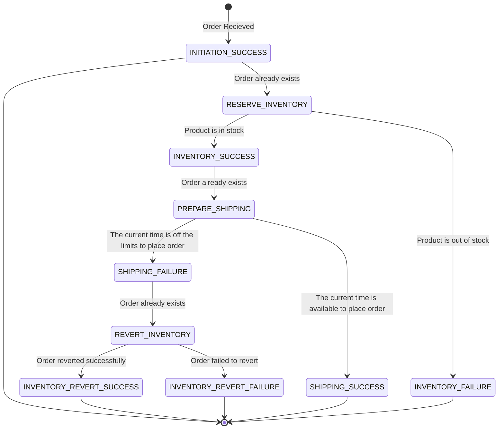

# java-spring-boot-microservices-demo

A message-driven architecture with Reactive Programming

# State diagrams

```mermaid
stateDiagram-v2
    [*] --> INITIATION_SUCCESS: Order Recieved
    INITIATION_SUCCESS --> [*]

    INITIATION_SUCCESS --> RESERVE_INVENTORY: Order already exists
    RESERVE_INVENTORY --> INVENTORY_SUCCESS: Product is in stock
    RESERVE_INVENTORY --> INVENTORY_FAILURE: Product is out of stock
    
    INVENTORY_SUCCESS --> PREPARE_SHIPPING: Order already exists
    PREPARE_SHIPPING --> SHIPPING_SUCCESS: The current time is available to place order
    PREPARE_SHIPPING --> SHIPPING_FAILURE: The current time is off the limits to place order

    SHIPPING_FAILURE --> REVERT_INVENTORY: Order already exists
    REVERT_INVENTORY --> INVENTORY_REVERT_SUCCESS: Order reverted successfully
    REVERT_INVENTORY --> INVENTORY_REVERT_FAILURE: Order failed to revert
    
    INVENTORY_REVERT_SUCCESS --> [*]
    INVENTORY_REVERT_FAILURE --> [*]
    SHIPPING_SUCCESS --> [*]
    INVENTORY_FAILURE --> [*]

```
